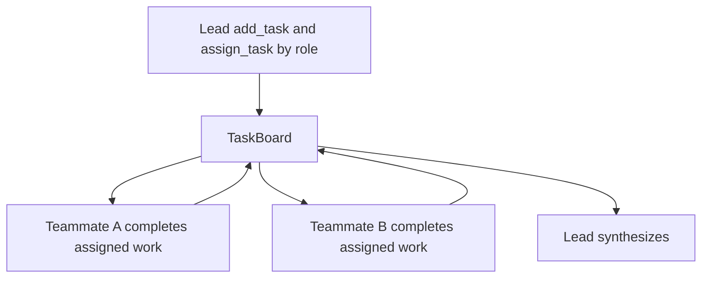

# Collaborative teams

[`CollaborativeTeam`][pydantic_team.collaborative.CollaborativeTeam] coordinates
teammates through a shared [`TaskBoard`][pydantic_team.board.TaskBoard].

Unlike [`HierarchicalTeam`](hierarchical.md) (leader delegates via member tools and
synthesizes), collaborative mode:

1. Leader **creates** tasks and **assigns** each to the right teammate by role
2. Members **complete** tasks assigned to them in **parallel** rounds (claim only
   residual open tasks that match their role)
3. Leader synthesizes a final answer from the board

Peer-to-peer messaging between teammates is **not** included yet. Members cannot
create sub-tasks in this version.



## Construction

```python
from pydantic_ai import Agent
from pydantic_team import CollaborativeTeam

researcher = Agent(
    'openai:gpt-4.1',
    name='researcher',
    instructions='Complete only research tasks assigned to you.',
)
writer = Agent(
    'openai:gpt-4.1',
    name='writer',
    instructions='Complete only writing tasks assigned to you.',
)

team = CollaborativeTeam(
    leader_model='openai:gpt-4.1',
    members=[researcher, writer],
    system_prompt_override=(
        'Assign every task to researcher or writer by role; never leave tasks open.'
    ),
    max_rounds=3,
)
result = await team.run('Produce a short report on agent teams')
print(result.data)
print(result.usage)
```

- `max_rounds`: parallel member ticks after the leader seeds the board
- Members must be agents (nested teams are not supported in this slice)
- Pass `usage=` to accumulate [`RunUsage`](https://ai.pydantic.dev/api/usage/) across lead + members
- Prefer **assign-by-role** over free-for-all claim so a writer does not take research work

## Board operations

| Who | Tools |
|-----|--------|
| Lead | `add_task`, `assign_task`, `list_tasks` |
| Members | `list_tasks`, `claim_task`, `complete_task` |

After `assign_task`, the task is `claimed` for that assignee (not stealable via claim).
Claim remains for residual `open` tasks only.

Orchestration phases (`collaborative.run` / `.seed` / `.round` / `.synthesize`)
emit OpenTelemetry spans when
[`instrument_pydantic_team`][pydantic_team.instrument_pydantic_team] is enabled.
Board tool calls are visible via `logfire.instrument_pydantic_ai()` — see
[Observability](index.md#observability).

## Task model

See [`Task`][pydantic_team.board.Task] / [`TaskStatus`][pydantic_team.board.TaskStatus]:
`open` → `claimed` → `done`, with optional `assignee` and `result`.

## Testing

Use [`TestModel`](https://ai.pydantic.dev/testing/) and `agent.override` — same as hierarchical teams.
Unit tests cover board races without live LLM calls.
