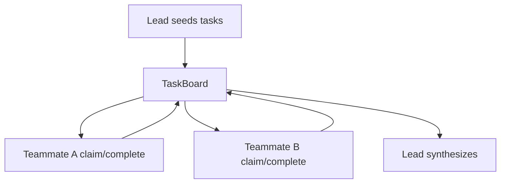

# Collaborative teams

[`CollaborativeTeam`][pydantic_team.collaborative.CollaborativeTeam] coordinates
teammates through a shared [`TaskBoard`][pydantic_team.board.TaskBoard].

Unlike [`HierarchicalTeam`](hierarchical.md) (leader delegates via member tools and
synthesizes), collaborative mode:

1. Leader **creates / assigns** tasks on the board
2. Members **claim** open tasks and **complete** them in **parallel** rounds
3. Leader synthesizes a final answer from the board

Peer-to-peer messaging between teammates is **not** included yet.



## Construction

```python
from pydantic_ai import Agent
from pydantic_team import CollaborativeTeam

researcher = Agent('openai:gpt-4o', name='researcher', instructions='Claim research tasks.')
writer = Agent('openai:gpt-4o', name='writer', instructions='Claim writing tasks.')

team = CollaborativeTeam(
    leader_model='openai:gpt-4o',
    members=[researcher, writer],
    max_rounds=3,
)
result = await team.run('Produce a short report on agent teams')
print(result.data)
print(result.usage)
```

- `max_rounds`: parallel member ticks after the leader seeds the board
- Members must be agents (nested teams are not supported in this slice)
- Pass `usage=` to accumulate [`RunUsage`](https://ai.pydantic.dev/api/usage/) across lead + members

## Board operations

| Who | Tools |
|-----|--------|
| Lead | `add_task`, `assign_task`, `list_tasks` |
| Members | `list_tasks`, `claim_task`, `complete_task` |

Claim is atomic: only one teammate wins a race on the same open task.

## Task model

See [`Task`][pydantic_team.board.Task] / [`TaskStatus`][pydantic_team.board.TaskStatus]:
`open` → `claimed` → `done`, with optional `assignee` and `result`.

## Testing

Use [`TestModel`](https://ai.pydantic.dev/testing/) and `agent.override` — same as hierarchical teams.
Unit tests cover board races without live LLM calls.
