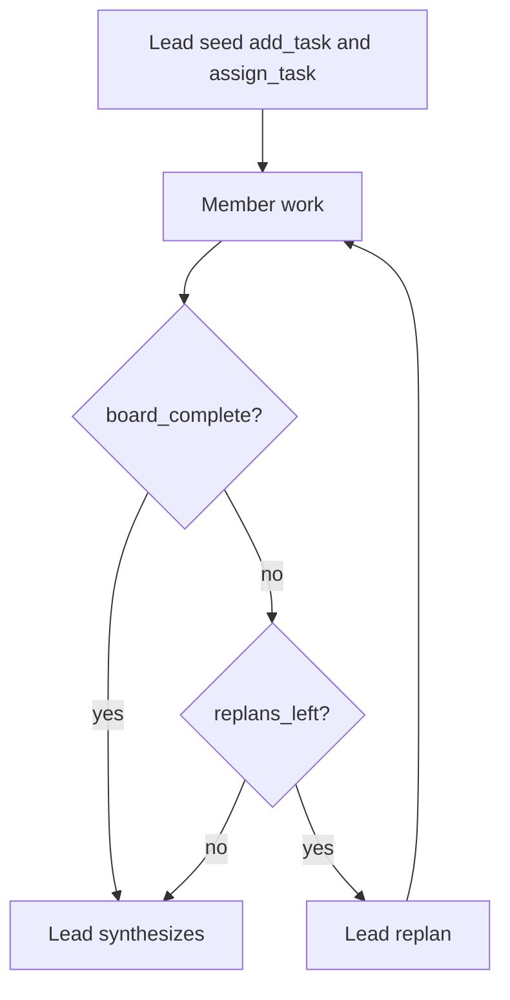

# Collaborative teams

[`CollaborativeTeam`][pydantic_team.collaborative.CollaborativeTeam] coordinates
teammates through a shared [`TaskBoard`][pydantic_team.board.TaskBoard].

Unlike [`HierarchicalTeam`](hierarchical.md) (leader delegates via member tools and
synthesizes), collaborative mode:

1. Leader **creates** tasks and **assigns** each to the right teammate by role
2. Members **complete** assigned work — either in **phased** parallel rounds after
   seed, or with **streaming** dispatch (members start as soon as they are assigned,
   overlapping seed/replan)
3. If the board is still incomplete and `max_replans` allows it, the leader
   **replans** (more `add_task` / `assign_task`), then member work continues
4. Leader synthesizes a final answer from the board (**toolless** cycle: board
   mutation tools are not available; the completed board is passed in the prompt)

Peer-to-peer messaging between teammates is **not** included yet. Members cannot
create sub-tasks in this version. There is no per-task approve/reject gate yet.



In `dispatch_mode='streaming'`, member ticks can start during seed/replan (not only
after those leader turns finish). Phased mode keeps a barrier between seed and
member rounds — parallel members alone do **not** optimize end-to-end latency.

## Observing a run

`team.run(...)` is a thin wrapper around [`CollaborativeRun`][pydantic_team.collaborative.CollaborativeRun].
For step-by-step observation (inspired by [pydantic-graph](https://ai.pydantic.dev/graph/)
`iter`, without modeling the team as a GraphBuilder):

```python
from pydantic_team import CollaborativeTeam, PhaseJoined, RunEnded, TasksScheduled

async with team.iter('Produce a short report') as run:
    async for event in run:
        if isinstance(event, TasksScheduled):
            print('scheduled', [t.kind for t in event.tasks])
        elif isinstance(event, PhaseJoined):
            print('joined', event.phase, 'incomplete=', event.incomplete)
        elif isinstance(event, RunEnded):
            print('done', event.result.data)
    assert run.result is not None
```

Events: `TasksScheduled`, `TaskCompleted`, `PhaseJoined`, `RunEnded` (see
[`TeamTask`][pydantic_team.events.TeamTask]). Use `run.board` for a live snapshot.

## Construction

```python
from pydantic_ai import Agent
from pydantic_team import CollaborativeTeam

researcher = Agent(
    'openai:gpt-4.1',
    name='researcher',
    instructions='Complete only research tasks assigned to you.',
)
writer = Agent(
    'openai:gpt-4.1',
    name='writer',
    instructions='Complete only writing tasks assigned to you.',
)

team = CollaborativeTeam(
    leader_model='openai:gpt-4.1',
    members=[researcher, writer],
    system_prompt_override=(
        'Assign every task to researcher or writer by role; never leave tasks open.'
    ),
    max_rounds=3,
    max_replans=2,
    dispatch_mode='streaming',  # members start on assign; default is 'phased'
)
result = await team.run('Produce a short report on agent teams')
print(result.data)
print(result.usage)
```

- `dispatch_mode`: `'phased'` (default) = seed barrier then member rounds; `'streaming'` =
  ready-queue dispatch so members overlap with seed/replan
- `max_rounds`: in phased mode, parallel member ticks **per phase**; in streaming,
  max ticks **per member per phase** (after seed and after each replan)
- `max_replans`: how many times the leader may replan after an incomplete member phase
  (default `0` = seed → work → synthesize only)
- `max_assignments_per_tick`: optional cap on how many incomplete assignments are listed
  for a member in one tick (forces leftover work into later ticks / replan)
- Members must be agents (nested teams are not supported in this slice)
- Pass `usage=` as a team-level aggregate: each seed / replan / synthesize / member
  tick is an isolated `agent.run` with its own usage budget (so the default
  `request_limit` applies per cycle), then folded into the aggregate
- Prefer **assign-by-role** over free-for-all claim so a writer does not take research work

## Board operations

| Who | Tools |
|-----|--------|
| Lead (seed / replan) | `add_task`, `assign_task`, `list_tasks` |
| Lead (synthesize) | none — final answer only |
| Members | `list_tasks`, `claim_task`, `complete_task` |

After `assign_task`, the task is `claimed` for that assignee (not stealable via claim).
Claim remains for residual `open` tasks only.

Orchestration phases (`collaborative.run` / `.seed` / `.round` / `.replan` /
`.synthesize`, plus `.dispatch` / `.member_tick` in streaming mode) emit OpenTelemetry
spans when
[`instrument_pydantic_team`][pydantic_team.instrument_pydantic_team] is enabled.
Board tool calls are visible via `logfire.instrument_pydantic_ai()` — see
[Observability](index.md#observability).

## Task model

See [`Task`][pydantic_team.board.Task] / [`TaskStatus`][pydantic_team.board.TaskStatus]:
`open` → `claimed` → `done`, with optional `assignee` and `result`.

## Testing

Use [`TestModel`](https://ai.pydantic.dev/testing/) and `agent.override` — same as hierarchical teams.
Unit tests cover board races without live LLM calls.
