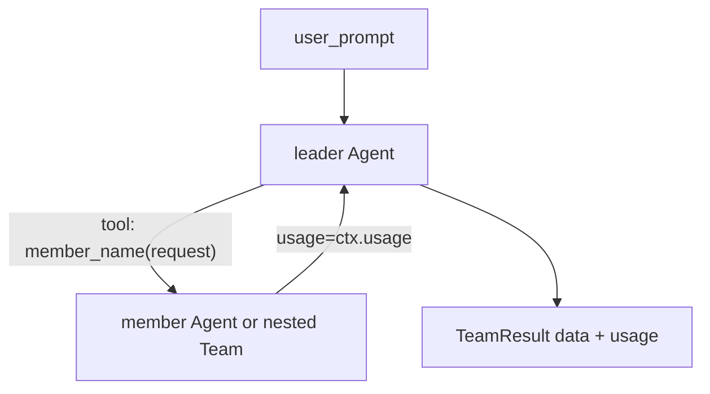

# Hierarchical teams

[`HierarchicalTeam`][pydantic_team.hierarchical.HierarchicalTeam] wraps a leader
[`Agent`](https://ai.pydantic.dev/agent/) and registers each member as a delegation tool.



## Construction

Provide **either** `leader_agent` **or** `leader_model` (not both), plus a non-empty
`members` sequence.

```python
from pydantic_ai import Agent
from pydantic_team import HierarchicalTeam

researcher = Agent(
    'openai:gpt-4.1',
    name='researcher',
    description='Collect concise research notes',
    instructions='Research the topic and return notes.',
)
writer = Agent(
    'openai:gpt-4.1',
    name='writer',
    description='Turn notes into prose',
    instructions='Write a short article from the notes.',
)

team = HierarchicalTeam(
    leader_model='openai:gpt-4.1',
    members=[researcher, writer],
    system_prompt_override=(
        'Delegate to researcher or writer based on the task, '
        'then synthesize a final answer.'
    ),
)
```

- `name` / `description` on members become the tool name and description for the leader.
- `system_prompt_override` sets leader instructions when building from `leader_model`,
  or adds a system prompt when using an existing `leader_agent`.
- Optional `name=` on the team is used when this team is nested as a member tool.

## Usage tracking

Nested runs pass the parent [`RunContext.usage`](https://ai.pydantic.dev/api/tools/#pydantic_ai.tools.RunContext.usage)
into `Agent.run(..., usage=...)` (and nested `BaseTeam.run(..., usage=...)`).

The returned [`TeamResult`][pydantic_team.base.TeamResult] exposes:

- `data` — final leader output
- `usage` — aggregated [`RunUsage`](https://ai.pydantic.dev/api/usage/) across the run

```python
result = await team.run('Summarize recent AI news')
print(result.data)
print(result.usage.requests, result.usage.total_tokens)
```

You can also seed a shared accumulator:

```python
from pydantic_ai.usage import RunUsage

usage = RunUsage()
result = await team.run('task', usage=usage)
```

Each member-tool call is wrapped in a `hierarchical.delegate` OpenTelemetry span
when [`instrument_pydantic_team`][pydantic_team.instrument_pydantic_team] is enabled
(see [Observability](index.md#observability)).

## Nested teams

Members may be agents **or** other [`BaseTeam`][pydantic_team.base.BaseTeam] instances
(typically another `HierarchicalTeam`). Set `name=` on the nested team so the outer
leader gets a clear tool id.

```python
germanic = HierarchicalTeam(
    name='germanic_team',
    leader_model='openai:gpt-4.1',
    members=[german_agent, dutch_agent],
)

language_team = HierarchicalTeam(
    leader_model='openai:gpt-4.1',
    members=[english_agent, chinese_agent, germanic],
)
```

## Testing without live APIs

Use pydantic-ai [`TestModel`](https://ai.pydantic.dev/testing/) and `agent.override`:

```python
from pydantic_ai import Agent
from pydantic_ai.models.test import TestModel
from pydantic_team import HierarchicalTeam

leader = Agent(TestModel(), name='leader')
member = Agent(TestModel(), name='worker')
team = HierarchicalTeam(leader_agent=leader, members=[member])

with leader.override(model=TestModel(custom_output_text='final')):
    with member.override(model=TestModel(custom_output_text='notes')):
        result = await team.run('hello')
assert result.data == 'final'
```

## When to use pydantic-graph instead

Use [pydantic-graph](https://ai.pydantic.dev/graph/) for deterministic sequences,
branches, loops, or rich shared state. `HierarchicalTeam` is for **LLM-driven
delegation and synthesis**, not a general workflow engine.
